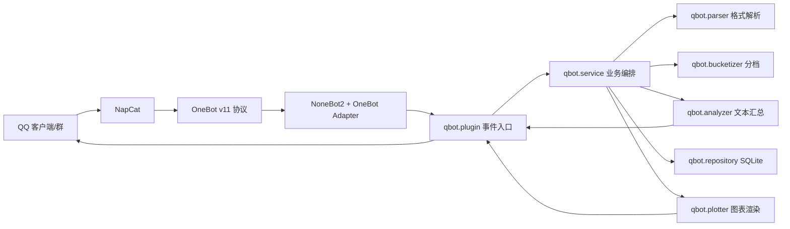

# qbot 技术报告（初稿）

## 1. 背景与目标

### 1.1 项目背景
本项目面向 QQ 群体的分数统计场景，群成员通常会将名片或昵称设置为 `分数-姓名`。管理员需要定期了解群体分数分布、关键位次（如第 202 名）和阶段性变化趋势。手工统计效率低且易出错，因此实现一个自动化机器人进行周期采集、结构化统计和可视化输出。

### 1.2 项目目标
1. 自动从群成员资料提取有效分数字段，并过滤噪声数据。
2. 按业务规则完成分档与累计统计，输出可直接阅读的文本摘要。
3. 输出分布图与历史趋势图，支持群内快速感知结构变化。
4. 支持手动触发与定时触发，且在异常情况下可降级运行并保留可观测日志。

### 1.3 结果定义
以“可重复执行 + 统计规则一致 + 异常可恢复”为验收标准：同一群、同一时刻输入应产生稳定一致的统计结果，核心逻辑由单元测试覆盖。

## 2. 架构设计（NapCat + OneBot + NoneBot）

### 2.1 总体架构
系统采用“IM 协议适配层 + Bot 框架层 + 业务插件层 + 数据与可视化层”分层设计：

### 2.2 关键模块职责
1. `bot.py`：启动 NoneBot，注册 OneBot v11 适配器并加载 `qbot.plugin`。
2. `qbot.plugin`：处理 `/scorestat` 与 `/scorestat help`，并使用 APScheduler 定时触发统计任务。
3. `qbot.collector`：调用 OneBot API `get_group_member_list` 拉取群成员列表。
4. `qbot.service`：串联解析、分档、持久化、摘要生成和图表生成，是核心编排层。
5. `qbot.repository`：基于 `aiosqlite` 存储快照与桶统计，并提供趋势查询和历史清理。
6. `qbot.plotter`：基于 Matplotlib 输出分布柱状图和历史折线图。

### 2.3 触发机制
1. 手动触发：群消息中输入 `/scorestat`。
2. 定时触发：`cron` 配置为北京时间 `8:00-23:59` 间每 2 小时执行一次（`minute=0, hour=8-23/2`）。
3. 并发保护：每个群独立 `asyncio.Lock`，避免同群并发统计导致重复写库或重复发图。

## 3. 核心算法与规则

### 3.1 格式解析规则
解析函数：`parse_member_card`（`src/qbot/parser.py`）。

1. 正则：`^\\s*(\\d{1,3})\\s*[-—]\\s*(.+?)\\s*$`。
2. 支持连接符：半角 `-` 与中文长横 `—`。
3. 有效分数范围：`350 <= score <= 500`。
4. 无效输入（空串、格式不符、姓名为空、越界）直接丢弃。

### 3.2 5 分分档规则
分档函数：`build_buckets`（`src/qbot/bucketizer.py`）。

1. 桶起点计算：
   `start = ((score - 350) // 5) * 5 + 350`
2. 桶终点计算：
   `end = min(start + 4, upper_bound)`
3. 桶序列从 350 递增到 `upper_bound`，缺失桶补 0，确保图表横轴连续。

### 3.3 上限规则
上限函数：`compute_upper_bound`。

1. 公式：`upper_bound = min(500, max_score + 5)`。
2. 含义：统计到“当前最高分+5”并封顶 500，避免在低分群体场景产生大量空桶，同时保留适度前瞻区间。

### 3.4 累计统计规则
摘要函数：`summarize`（`src/qbot/analyzer.py`）。

1. 采用“从高到低累计”的人数统计：输出 `>= 某分数` 的累计人数与占比。
2. 关键位次：
   - 第 202 名分数；
   - 复录位次 `ceil(202*1.3)=263` 对应分数。
3. 当样本不足时输出“样本不足”，保证文本可读性与健壮性。

## 4. 关键实现与异常处理

### 4.1 业务主流程
`ScoreStatService.run_once` 执行链路：
1. 拉取群成员。
2. 解析有效成员并过滤无效样本。
3. 分档并计算上限。
4. 查询上次有效样本数用于环比文案。
5. 写入快照与桶数据。
6. 清理过期历史数据。
7. 生成文本摘要与两类图表（分布/趋势）。

### 4.2 异常处理设计
1. 任务重试：`_send_stat` 对统计流程最多重试 3 次，降低瞬时 API 抖动影响。
2. 手动触发限流：同群 8 秒冷却，避免刷屏与重复执行。
3. 外部调用降级：
   - 摘要发送失败：立即返回失败；
   - 图片发送失败：记录 warning，保留文本结果（部分降级）。
4. 无数据场景：当 `parsed` 为空时返回“无有效分数数据”，不写快照、不生成图片。
5. 数据保洁：按 `retention_days` 清理历史快照与桶数据，避免 SQLite 持续膨胀。

## 5. 调试排障记录

### 5.1 规则解析偏差
1. 现象：用户名片中同时存在 `-` 与 `—` 两种连接符。
2. 定位：单一连接符会导致有效样本被误过滤。
3. 处理：解析正则中并列支持 `[-—]`，并加入测试 `test_parse_valid_dash/test_parse_valid_em_dash`。

### 5.2 统计上限错误风险
1. 现象：若固定统计到 500，会在中低分群体出现大量空档。
2. 定位：可读性差，且无法突出当前有效分布密度。
3. 处理：采用 `min(500, max+5)` 动态上限，并通过 `test_compute_upper_bound` 验证。

### 5.3 高并发触发与重复执行
1. 现象：手动命令可能被短时间重复触发。
2. 定位：同群并发写库与重复消息会污染观察结果。
3. 处理：引入“群级锁 + 8 秒冷却”双层保护。

### 5.4 文档与实现不一致（需统一）
1. 现象：`README` 写“每 20 分钟自动统计”，代码实际为“8-23 点每 2 小时”。
2. 影响：运维预期与实际触发频率不一致。
3. 建议：在后续迭代中统一文档与调度配置，避免线上误判。

## 6. 测试与验证

### 6.1 单元测试覆盖
当前测试集共 10 项（`pytest -q`）：
1. `tests/test_parser.py`：格式解析正确性与边界过滤。
2. `tests/test_bucketizer.py`：上限计算、空数据、非 500 上限分桶。
3. `tests/test_analyzer.py`：无数据文案、环比文案、累计统计与关键分隔线。

### 6.2 验证结果
在当前代码快照下执行结果：
`10 passed in 0.04s`。

### 6.3 目前测试空白
1. 缺少 `service/repository/plugin` 层集成测试。
2. 缺少 OneBot API 异常注入（超时、返回空结构、发送失败）测试。
3. 缺少图表内容断言（仅生成成功，未校验图像语义）。

## 7. 后续优化建议

### 7.1 工程稳定性
1. 为 `run_once` 增加结构化日志（trace id、group_id、耗时、样本量）。
2. 引入集成测试（mock OneBot + 临时 SQLite）覆盖全链路。
3. 将调度频率改为可配置项（如 `QBOT_CRON` 或 `QBOT_SCHEDULE_MINUTES`），并与 README 自动同步。

### 7.2 统计能力演进
1. 增加分位数指标（P50/P75/P90）和波动率，避免仅依赖桶统计。
2. 引入异常值检测（例如同一成员短时跨越大幅分值）并告警。
3. 支持按角色/标签分组统计，提升管理决策价值。

### 7.3 产品与开源方向
1. 将规则引擎抽象为可插拔策略（解析规则、阈值、桶宽可配置），便于适配不同群体。
2. 输出机器可读接口（JSON）供外部看板接入，形成“机器人 + 数据看板”闭环。
3. 补充开发者文档与贡献指南（架构图、数据字典、测试指南），提升开源协作效率。

---

本报告为实现对齐的技术初稿，后续可在“部署拓扑、运行成本、线上指标基线”三部分继续补齐，形成可答辩/可交付版本。
